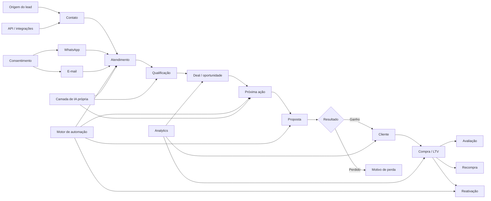
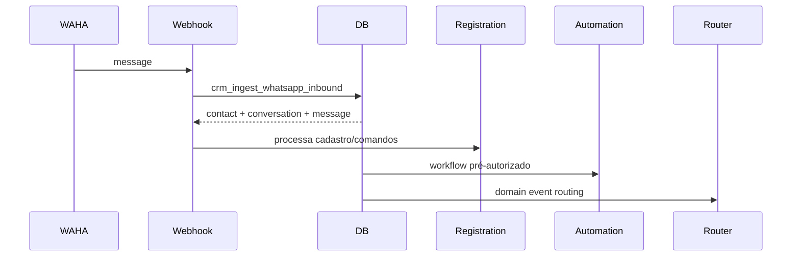
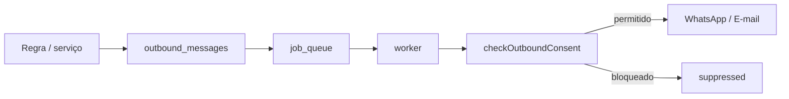
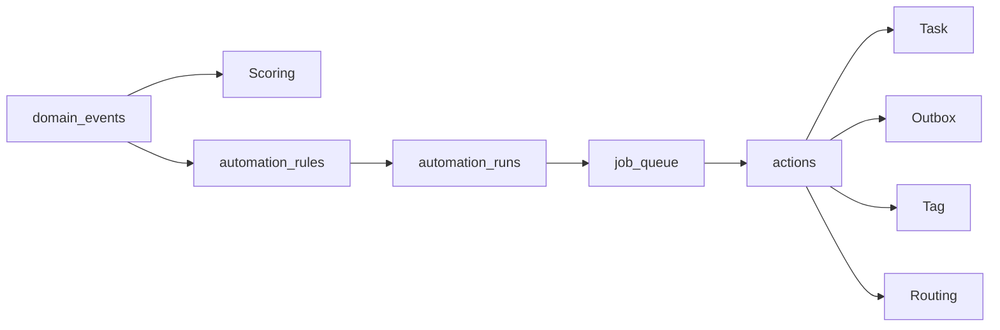
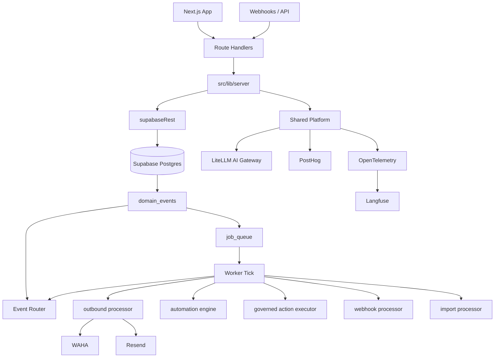

# CRM — System Map

> Documento canônico para entender produto, domínio, banco e código.
>
> Sempre que uma implementação mudar arquitetura, domínio, fluxo crítico ou ownership de módulos, atualizar este arquivo.

## 1. Produto em uma frase

CRM de execução comercial para empresas que vendem por conversa: captura o lead, organiza atendimento, garante próxima ação, acompanha proposta/venda e continua trabalhando recompra, avaliação e reativação.

**Produto independente.** Não depende de Argoplace, MIRA, VitalHub ou qualquer outro produto.

## 2. Mapa mental do produto



## 3. Regra central do produto

Toda oportunidade ativa deve ter:

1. **dono**;
2. **estado**;
3. **próxima ação**;
4. **prazo**;
5. **histórico auditável**.

O CRM não existe só para guardar cards. Ele existe para impedir dinheiro parado por falta de execução.

## 4. Fluxos críticos

### 4.1 WhatsApp inbound



Código:
- `src/app/api/webhooks/whatsapp/waha/route.ts`
- `src/lib/server/whatsapp/ingest.ts`
- `src/lib/server/registration/service.ts`

Banco:
- `contacts`
- `conversations`
- `messages`
- `contact_registration_sessions`

### 4.2 Mensagem outbound



Nunca enviar direto de regra de negócio para provider.

Código:
- `src/lib/server/outbound/processor.ts`
- `src/lib/server/consent/service.ts`
- `src/lib/server/worker/process.ts`

### 4.3 Cadastro pelo WhatsApp

```text
novo contato
  ↓
nome
  ↓
e-mail
  ↓
cidade opcional
  ↓
quer receber oportunidades?
  ↓
cadastro concluído
```

Config por tenant:
- `customer_registration_settings`

Estado:
- `contact_registration_sessions`

Código:
- `src/lib/server/registration/service.ts`
- `src/lib/server/registration/settings.ts`

### 4.4 Oportunidades

Oportunidade é uma finalidade própria. Não equivale a marketing genérico.

```text
oportunidade encontrada
  ↓
contact_opportunity_preferences.enabled?
  ↓
canal permitido?
  ↓
limite semanal?
  ↓
channel preference permite?
  ↓
outbox
  ↓
checagem de consentimento novamente
  ↓
provider
```

Código:
- `src/lib/server/opportunities/service.ts`
- `src/lib/server/consent/service.ts`

### 4.5 Automação



Código:
- `src/lib/server/automation/engine.ts`
- `src/lib/server/automation/conditions.ts`
- `src/lib/server/automation/actions.ts`
- `src/lib/server/automation/jobs.ts`
- `src/lib/server/automation/scoring.ts`

### 4.6 Event Router + ações governadas

```mermaid
flowchart LR
  E[Domain Event] --> R[Event Router]
  R --> C[Capability Owner]
  C --> P[Action Proposal]
  P --> A[Authorization]
  A --> I[Authorized Intent]
  I --> X[Adapter Registry]
  X --> H[Re-hydration]
  H --> W[Write]
  W --> V[Post-read Verify]
  V --> RCPT[Execution Receipt]
```



**Proposal ≠ Authorization ≠ Execution.**

O Router é usado para eventos sistêmicos, recomendações e ações propostas.  
O Automation Engine continua separado para workflows explicitamente configurados pelo tenant.

Código:
- `src/lib/server/router/event-router.ts`
- `src/lib/server/router/policy.ts`
- `src/lib/server/router/capabilities.ts`
- `src/lib/server/router/proposals.ts`
- `src/lib/server/router/authorization.ts`
- `src/lib/server/router/registry.ts`
- `src/lib/server/router/execution.ts`
- `src/lib/server/router/adapters/*`

Banco:
- `event_router_dispatches`
- `action_proposals`
- `authorized_intents`
- `action_execution_receipts`

Contrato completo: `docs/ROUTER.md`.

## 5. Mapa de domínio → código → banco

| Domínio | Código principal | Tabelas / views |
|---|---|---|
| Tenants e usuários | server + RLS | tenants, tenant_members |
| Contatos | customers/, timeline/ | contacts, contact_notes, contact_tags |
| Empresas B2B | accounts/ | accounts, account_contacts, account_metrics |
| Inbox | whatsapp/, departments/ | conversations, messages, departments |
| WhatsApp | whatsapp/ | whatsapp_connections, whatsapp_session_events |
| E-mail | email/ | email_connections, outbound_messages |
| Consentimento | consent/ | contact_channel_preferences |
| Oportunidades | opportunities/ | contact_opportunity_preferences |
| Cadastro WA | registration/ | customer_registration_settings, contact_registration_sessions |
| CRM comercial | domain + services | pipelines, pipeline_stages, deals |
| Tarefas | tasks/ | tasks |
| Propostas | proposals/ | proposals, proposal_items |
| Catálogo | catalog/ | catalog_items, price_books, price_book_items |
| Pós-venda | reviews/, lifecycle | customer_transactions, review_requests |
| Automação | automation/ | domain_events, automation_rules, automation_runs, job_queue |
| Event Router | router/ | event_router_dispatches, action_proposals, authorized_intents, action_execution_receipts |
| Outbound | outbound/ | outbound_messages, message_templates |
| API pública | public-api/ + app/api/v1 | api_keys, usage_* |
| Privacidade | privacy/ | privacy_requests |
| Analytics | analytics/ | deal_stage_history, deal_velocity |
| Billing SaaS | billing/ | tenant_subscriptions, usage_events, usage_counters |
| IA | ai/ | knowledge entries + contexto do domínio |
| Platform | platform/ + instrumentation | AI Gateway, PostHog, OTel/Langfuse |

## 6. Mapa técnico de runtime



## 7. WhatsApp lifecycle

```text
whatsapp_connections
  ↓ provision
WAHA session
  ↓
STARTING
  ↓
SCAN_QR_CODE → QR temporário
  ↓
WORKING
  ↓
connected
```

Se parar:
- `STOPPED` → disconnected
- `FAILED` → error
- `PASSKEY_REQUIRED` → pairing/manual intervention

Estado persistente:
- `whatsapp_connections`

Histórico:
- `whatsapp_session_events`

QR:
- **nunca persistir no banco**.

Código:
- `src/lib/server/whatsapp/waha-admin.ts`
- `src/app/api/internal/whatsapp/[tenantId]/session/route.ts`
- `src/app/api/internal/whatsapp/[tenantId]/qr/route.ts`

## 8. Invariantes que não podem ser quebrados

### Multi-tenant
Toda entidade de negócio deve estar isolada por `tenant_id`.

### Segurança
- `service_role` somente no backend.
- RLS em toda tabela pública.
- `SECURITY DEFINER` com `search_path = ''`.
- RPC privilegiada deve revogar PUBLIC/anon/authenticated.

### Side effects
Envio externo deve passar por fila/outbox quando houver possibilidade de retry, duplicação ou falha parcial.

### Consentimento
Nenhuma mensagem promocional pode ignorar preferência do contato.

### Idempotência
Inbound, jobs, automações, webhooks, usage e importações precisam tolerar retry.

### Providers
Domínio não conhece detalhes de WAHA/Resend. Provider é adapter.

### Router
- evento é gatilho, não autorização;
- Action Proposal nunca executa diretamente;
- Authorization não chama adapter;
- execução governada exige adapter registrado;
- write precisa de post-read verification;
- `unknown` bloqueia replay cego.

### IA
A IA é componente do CRM, não autoridade do banco. Pode criar Proposal, nunca Authorized Intent fingindo autoridade e nunca executa adapter diretamente.

### Shared Platform
- produtos não chamam provider de IA diretamente;
- LiteLLM/OpenAI-compatible gateway é a fronteira de modelos;
- PostHog recebe analytics de produto sem PII/conteúdo;
- OpenTelemetry é o padrão de tracing;
- Langfuse observa IA/agentes atrás do OTel;
- Supabase Queues/Cron/pgvector entram somente por caso validado;
- tecnologia nova precisa passar pelo Tech Radar.

### Independência
Não introduzir dependência de Argoplace, MIRA ou VitalHub.

## 9. Onde alterar cada coisa

| Quero mudar... | Comece por |
|---|---|
| regra de automação | `src/lib/server/automation/` |
| roteamento de eventos/capabilities | `src/lib/server/router/policy.ts` + `capabilities.ts` |
| ações propostas/autorizadas | `src/lib/server/router/` |
| adapters governados | `src/lib/server/router/adapters/` |
| envio WhatsApp | `src/lib/server/whatsapp/` + outbound |
| conexão/QR WAHA | `src/lib/server/whatsapp/waha-admin.ts` |
| envio e-mail | `src/lib/server/email/` |
| opt-in/opt-out | `src/lib/server/consent/` e opportunities |
| cadastro pelo WhatsApp | `src/lib/server/registration/` |
| pipeline/deal | migrations + domain/services |
| proposta | `src/lib/server/proposals/` |
| tarefa/follow-up | `src/lib/server/tasks/` |
| Customer 360 | customers/timeline/custom-fields |
| API externa | `src/app/api/v1/` + public-api |
| LGPD | `src/lib/server/privacy/` |
| métricas SaaS | billing/entitlements |
| IA | `src/lib/server/ai/` + knowledge |
| gateway/modelos | `src/lib/server/platform/ai/gateway.ts` |
| analytics de produto | `src/lib/server/platform/analytics/posthog.ts` |
| observabilidade de IA | `src/lib/server/platform/observability/` + `src/instrumentation.ts` |

## 10. Estado atual do produto

### Backend já estruturado
- multi-tenant + RLS;
- CRM/deals/tasks/propostas;
- Inbox e WhatsApp;
- SLA/roteamento;
- cadastro pelo WhatsApp;
- e-mail outbound;
- consentimento/oportunidades;
- Customer 360;
- automações/jobs/outbox;
- Event Router + capability owners;
- Action Proposal → Authorized Intent → Adapter → Verify;
- importação CSV;
- API pública inicial;
- privacidade;
- analytics;
- subscriptions/usage;
- shared AI Gateway;
- server-side product analytics;
- OpenTelemetry/Langfuse AI tracing.

### Ainda não é produção comercial completa
Faltam principalmente:
- Supabase isolado implantado;
- Vercel isolada;
- auth/onboarding;
- WAHA real provisionado em infraestrutura;
- worker agendado real;
- billing provider;
- testes E2E e observabilidade;
- frontend final.

## 11. Regra para novas implementações

Antes de adicionar feature:

1. identificar domínio e capability owner;
2. decidir tabela/evento;
3. garantir `tenant_id`;
4. decidir se é workflow pré-autorizado ou ação proposta;
5. recomendação sistêmica/IA com write deve virar Action Proposal;
6. side effect resiliente usa job/outbox;
7. definir idempotência e verificação pós-write;
8. definir consentimento/segurança;
9. atualizar este mapa se o fluxo estrutural mudar.
